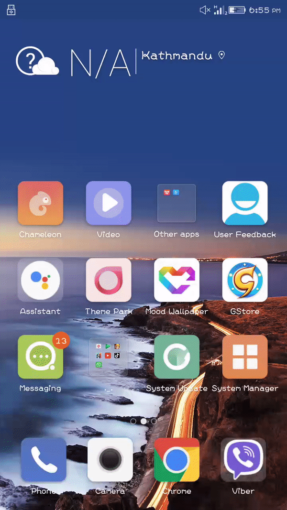
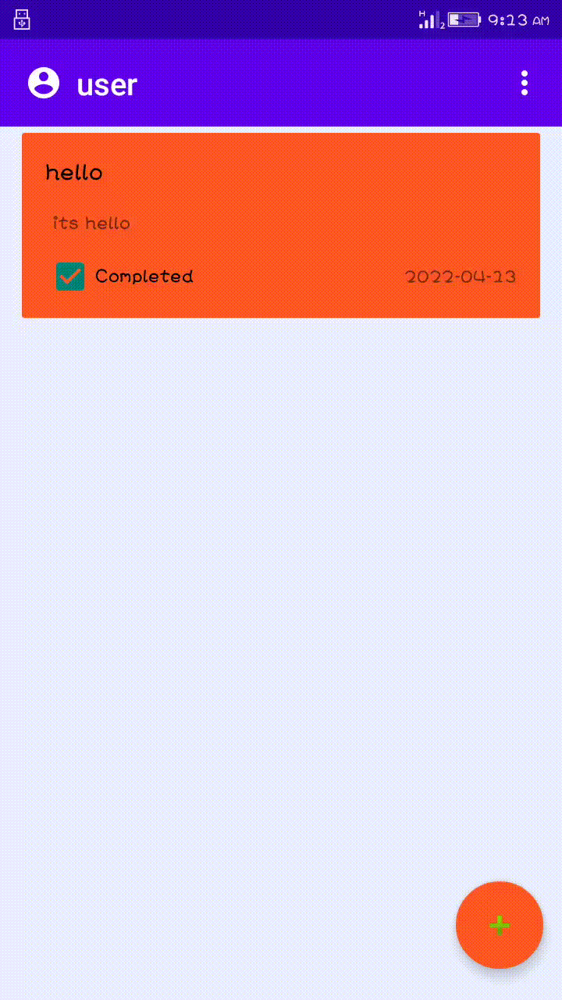
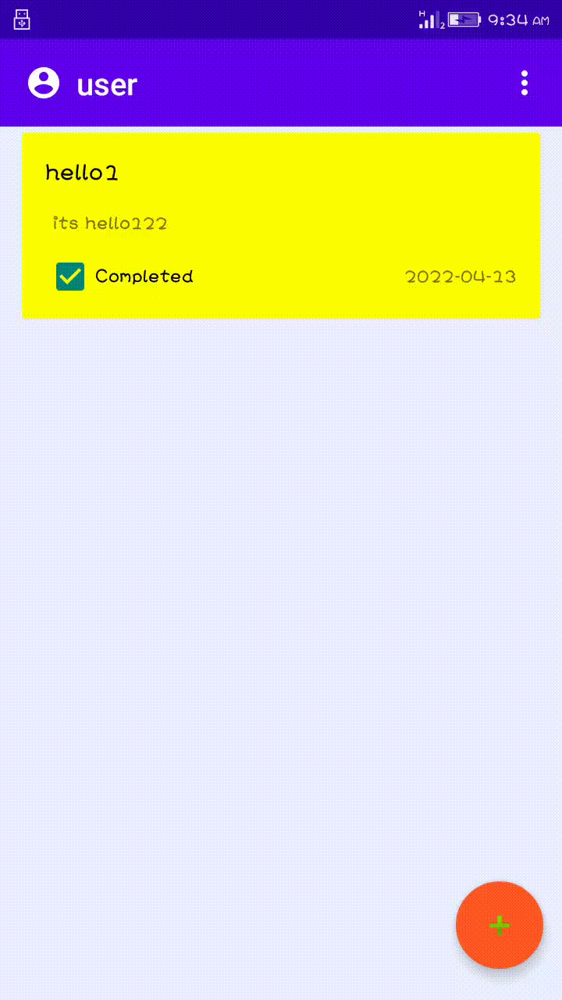
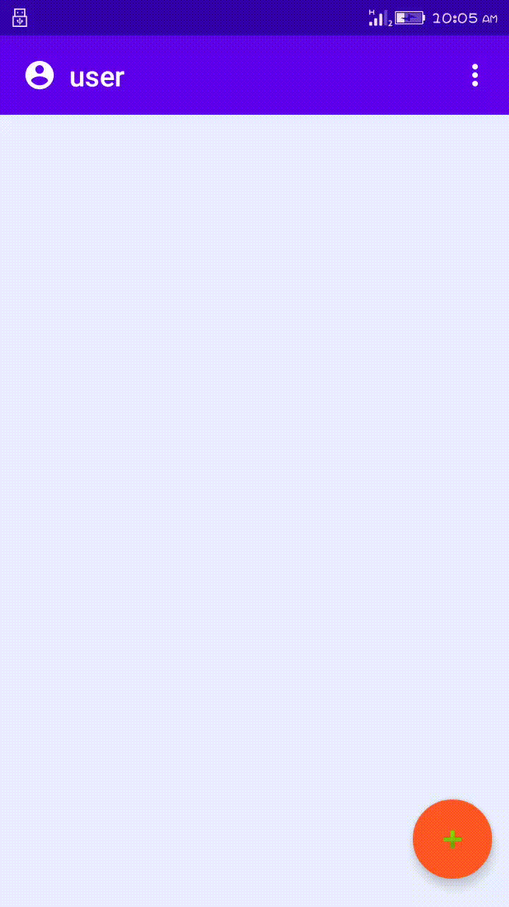
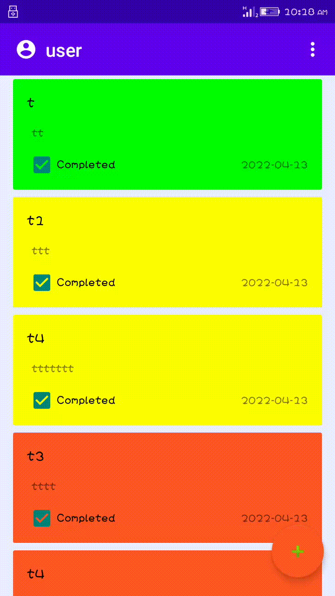
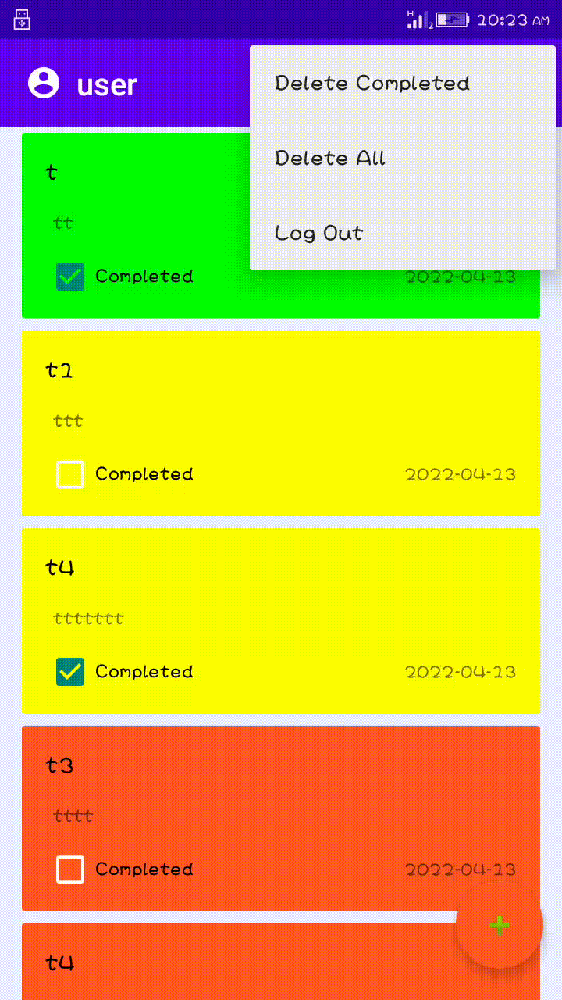
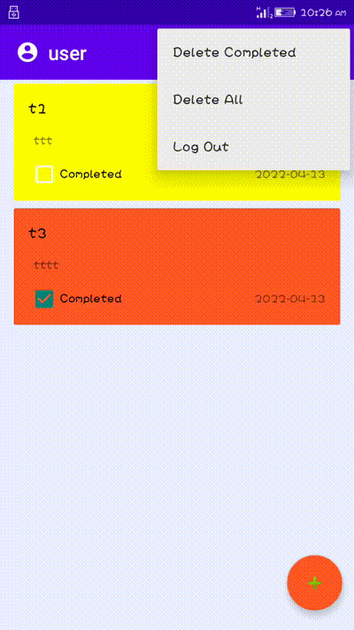
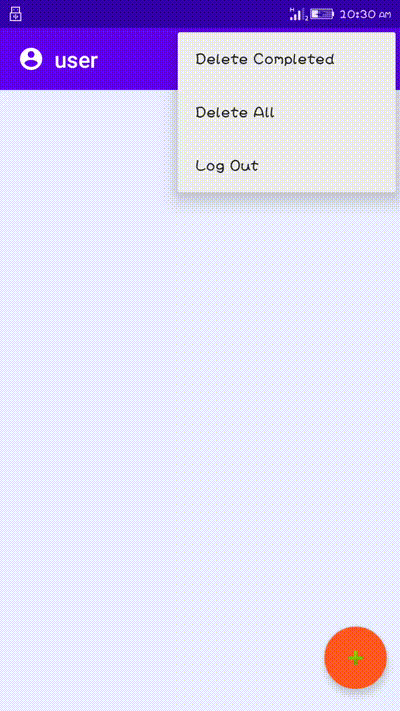
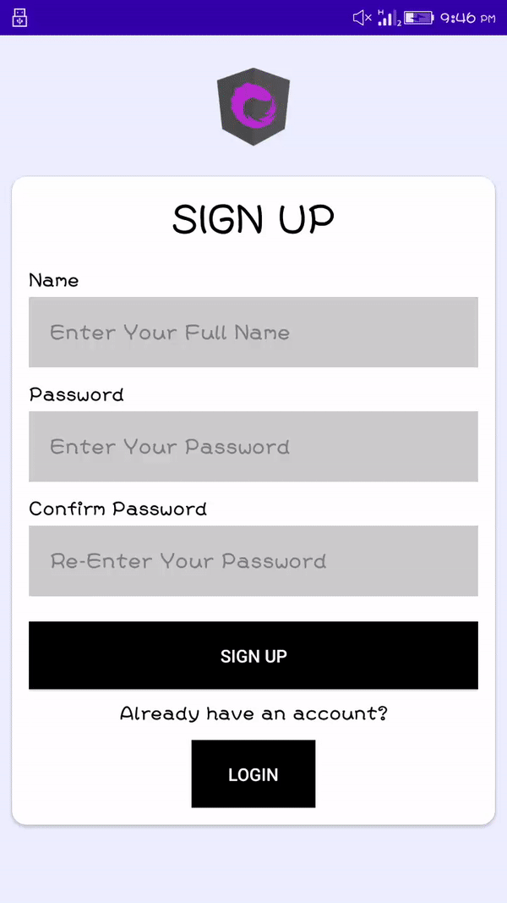

# TodoApp

<h1>Features of TodoApp</h1>
<ul>
	<li>Add your own todo with title, description, complete status and date.</li>
	<li>Edit the todo that were added by double tab the given each lists.</li>
	<li>Display the todo specific to the user in the home page.</li>
	<li>Delete individual todo by swiping.</li>
	<li>Delete all the todos that are completed.</li>
	<li>Delete all the todos.</li>

</ul>

<h1>Additional features</h1>
<ul>
    <li>Form validation.</li>
	<li>Change completion status of todo from home page.</li>
	<li>Multiple account signup and login.</li>
	<li>View your account profile and change password.</li>
	<li>Delete your account.</li>
</ul>

### Starting of the application

**The above gif file show the starting phase of the application by clicking the todo icon from the mobile.
After it will take to the welcome page and to the login page after three second in Splash page.**
---

### Registration

**We need to register in order to login.**

**Register detail name must be different validation and empty validation.**

**The above two Records illustrate the registration form with validation like an empty field, the user already exists and the password does not match. After
registration completed it will show the toast message saying register successful.**
---

### Login

**Validation is done for login. After login successful.** 
 
**The record is all about the login system in the application with validation like the user does not exist, empty fields and username, as well as the password, does not match.
After the login is successful it will redirect to the todo list page through which we can view the profile,deleted completed tasks only,
delete all,log out our account and can do crud operation of the tasks.**
---
### Add

**Adding the items in the list.** 
 
**The Record shows the adding the task to the todo lists. To add the list of data by clicking floatingactionbutton which lies bottom left corner, then it will redirect to the task insert form
through which data are inserted after clicking save and the form consists of some validation .lastly it will redirect to the todo list page by showing the task according to
prefer the color chosen for each task.**
---
### Update

**double tab the given items for update.** 
 
**This Record is all about the update event for the task. A double tab event is used to update the task. After this event is done
it will redirect to the task update form with related information in it. when the update button is clicked then it will redirect back to
the todo lists page and if the cancel button is clicked then an update will not happen to that task.**
---
### Delete

**You can delete task by swiping left and right the task.** 
 
**To delete the task by swapping the task left or right will automatically delete the task and it will show a toast message one task is deleted.**
---
### User Profile

**user profile we can delete the user and update password.** 
 
**By clicking the profile name or icon from the toolbar, it will redirect us to the user profile page from where we can delete our
personal account and update password.**
---
### List

**view the list of data.** 
 
**This page shows the all the todo task.**
---
### Delete task selected Completed tasks only

**Open the menu options and select delete completed to delete completed tasks only.** 

---
### Delete All

**Open the menu options and select delete all to delete every tasks.** 

---
### Logout

**To logout from the app, you can click the power off button on the menu bar.** 

---
### Landscape 

**Run whole application in landscape.** 
 
**The above record shows the whole application page with landscape.**
---