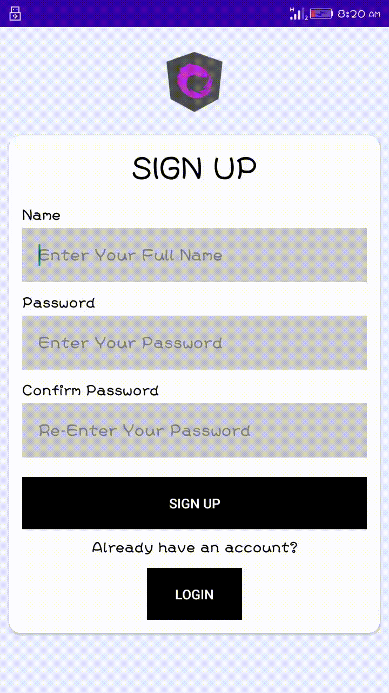
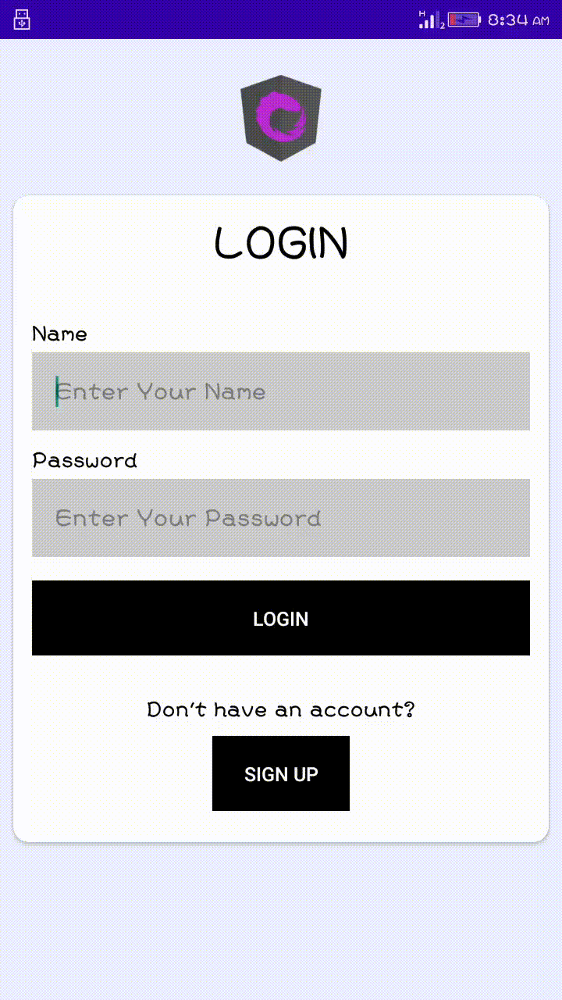

# TodoApp

<h1>Features of TodoApp</h1>
<ul>
	<li>Add your own todo with title, description, complete status and date.</li>
	<li>Edit the todo that were added by double tab the given each lists</li>
	<li>Display the todo specific to the user in the home page.</li>
	<li>Delete individual todo by swiping.</li>
	<li>Delete all the todos that are completed.</li>
	<li>Delete all the todos.</li>

</ul>

<h1>Additional features</h1>
<ul>
    <li>Form validation.</li>
	<li>Change completion status of todo from home page.</li>
	<li>Multiple account signup and login</li>
	<li>View your account profile and change password.</li>
	<li>Delete your account.</li>
</ul>

# Todo-App

# Icon
Icon that is used for app is the one inside the circle. 

# Registration
We need to register in order to login. 

Register detail name must be different validation and empty validation 

# Login
Validation is done for login. After login successful 

# Add

# Update

# Delete
You can delete task by swiping the task. 

# List

# Delete All
Open the menu options and select delete all to delete every tasks. 

# Logout
To logout from the app, you can click the power off button on the menu bar. 

# Landscape Add

# Landscape List
