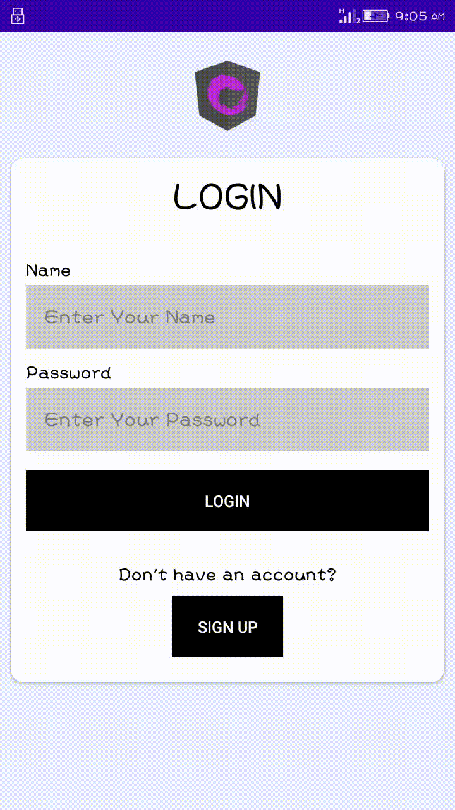

# TodoApp

<h1>Features of TodoApp</h1>
<ul>
	<li>Add your own todo with title, description, complete status and date.</li>
	<li>Edit the todo that were added by double tab the given each lists</li>
	<li>Display the todo specific to the user in the home page.</li>
	<li>Delete individual todo by swiping.</li>
	<li>Delete all the todos that are completed.</li>
	<li>Delete all the todos.</li>

</ul>

<h1>Additional features</h1>
<ul>
    <li>Form validation.</li>
	<li>Change completion status of todo from home page.</li>
	<li>Multiple account signup and login</li>
	<li>View your account profile and change password.</li>
	<li>Delete your account.</li>
</ul>

# Todo-App

# Registration
**We need to register in order to login.** 

**Register detail name must be different validation and empty validation** 

**The above two Record illustrate the registration form with validation like empty field, user already exist and password does not match. After 
registration completed it will show the toast message saying register successful**

# Login
**Validation is done for login. After login successful.** 

**The record is all about the login system in the application with validation like user does not exists, empty fields and username as well as password does not match.
After the login is successful it will redirect to todo list page through which we can view profile,deleted completed task only,
delete all ,logout our account and can do crud operation of the tasks**

# Add
**Adding the items in the list.** 

**The Record shows the adding the task in the todo lists. To add the list of data by clicking floatingactionbutton which lie bottom left corner,then it will redirect to insert form
through which data are inserted after clicking save and form consist of some validation .lastly it will redirect to todo list page by showing the task according to
prefer color chosen for each task.**

# Update
**double tab the given items for update.** 

**This Record is all about the update event for the task. double tab event is used to update the task.After this event is done
it will redirect to update form with related information in it. when the update button is clicked then it will redirect back to 
todo lists page and cancel button is clicked then update will not happen to that task.**

# Delete
**You can delete task by swiping left and right the task.** 

**To delete the task the swapping the task left or right it will automatically delete the task amd it will show toast message one task deleted.**

#user profile
**user profile we can delete the user and update password.** 

**By clicking the profile name or icon from the toolbar, it will redirect us to user profile page from where we can delete our
personal account and update password.**

# List
view the list of data 

**This page shows the all the todo task **

#Delete task selected Completed tasks only
**Open the menu options and select delete completed to delete completed tasks only.** 

# Delete All
**Open the menu options and select delete all to delete every tasks.** 

# Logout
**To logout from the app, you can click the power off button on the menu bar.** 

# Landscape 
**Run whole application in landscape.** 

